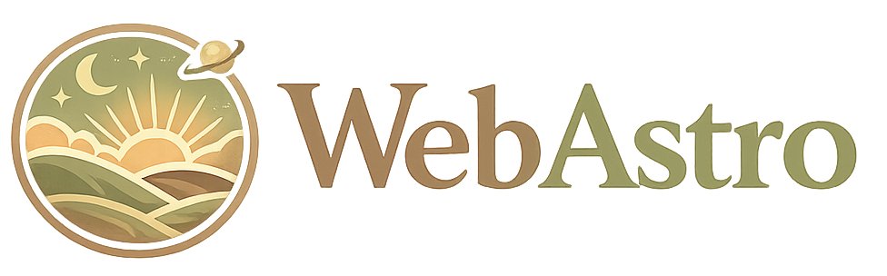

# WebAstro

## [See the WebAstro!](https://webastro-tan.vercel.app/)

## Description

**NOTE -** Describe your project in one/two lines.

#### [astrology-app-client](https://github.com/AybikeCV/astrology-app-client)

#### [astrology-app-server](https://github.com/AybikeCV/astrology-app-server)

## Technologies, Libraries & APIs used

HTML, CSS, JavaScript, React, axios, React Router, Vite , Package.json , node.js. Postman

PhotoPea.com and AI for images and image editing

AI for simplyfying the explanations of using dates with functions to better understanding//Bonus Function

## Backlog Functionalities

I connected only zodiac signs to their triplicity(element) property and comments, however, they can also connect with duality and quadriplicity(quality) properties too.
I think, search, and CRUD functions, especially Create and Update could be improved.

Learn your sign function (As a Bonus) is also can be improved, and since it was a new function for me working with dates, I had struggles. To start with a functionality with no background experience is really difficult and it resulted with extra coding than I thought. I read tutorials, and some points asked advices to AI to simplify explanations.

CSS can be improved, furthermore all the css can be designed with libraries such as ReactBootstrap or TailWindCss

I would still like to also with also an external API to create birthChart functionality.

# Client Structure

## User Stories

List here all the actions a user can do in the app.

- **404** - User sees a nice 404 page when they go to a page that doesn’t exist.
- **homepage** - User can access the homepage so that they see what the app is about, and learn their zodiac signs, and with the navbar, they can access signs, triplicities, comments and about pages.
- **signs** - User can see all the zodiac signs listed, they can add/remove their favorite signs, click on the signs to see the sign details.
- **triplicities** - User can see all the triplicities listed, click on the triplicity to see the triplicity details and which zodiac signs belong to a specific triplicity.
- **comments** - User can see all the comments listed, they can add/edit/remove their comments on a sign. -**search** - User can search signs and triplicities
- **about** - User can see the information about the person who created the webssite

## Client Routes

## React Router Routes (React App)

| Path | Page | Components | Behavior |
| ---- | ---- | ---------- | -------- |

| `/` | Homepage/Hero | | Hero |

| `/signs` | AllSignsList | SignCard | Lists all zodiac signs |

| `/signs/:signId` | SignDetail | | Shows the details of a specific zodiac sign |

| `/triplicities` | AllTriplicities | Triplicitiy Card | Lists all triplicities |
| `/triplicities/:triplicityId` | TriplicityDetail | | Shows the details of a specific triplicity |

| `/comments` | Comments | CommentCard | Lists all comments, user can add/delete comments, and choose the comment they want to edit. |

| `/comments/:commentId/edit` |Edit Comment | | User can edit the comment |

| `/about` | AboutPage | | Shows the info about the website creator |

| `*` | NotFound | | 404 Not Found Page |

## Other Components

- Navbar: Navigation that links to different pages and shows up every page, also has search function // SearchFunction
- Footer: Shows up every page

## Links

### Collaborators

[Aybike Celebi Visser](https://github.com/AybikeCV)

### Project

[astrology-app-client](https://github.com/AybikeCV/astrology-app-client)

[astrology-app-server](https://github.com/AybikeCV/astrology-app-server)

[Deploy Link](https://webastro-tan.vercel.app/)

### Excalidraw

[Sketches/BrainStorming/Journaling](https://excalidraw.com/#json=UdngzgGZoVcx4qsdL1Pqh,lu7w9fsEASdt_iv3fzkvvw)

### Slides

[Slides Link](https://docs.google.com/presentation/d/1OuCYt1YBr4kBzWbyZbtl5pTA7JCvBGM1l6GRiTJo7pk/edit?usp=sharing)
